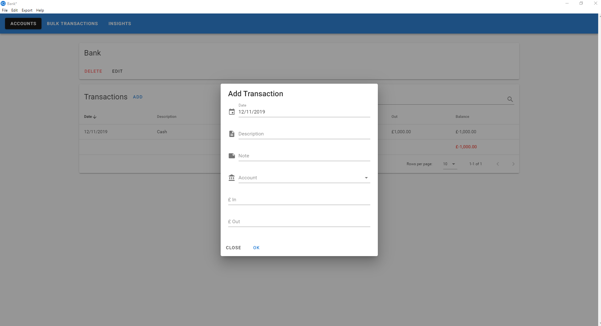

# Money Manager

Money Manager is a desktop application for managing your personal finances and accounts.

It uses [Electron](https://electron.atom.io/) as the application platform and [Vue.js](https://vuejs.org/) as the Front-End UI framework.

💲🤑 Be in control of your finances with Money Manager! 🏧👛

## Installation

Download the latest release [here](https://github.com/dhulme/money-manager/releases) and run the setup program.

## Features

💳 Keep track of transactions to and from your bank accounts and credit cards  
💰 Assign money from your accounts to different budgets  
💹 Get insights and analyse your spending and balances over time  
📅 Create bulk transactions that happen regularly, like paying bills or being paid your salary  
📤 Export your accounts and transactions as CSV  
🖊️ Highlight important transactions  
🕒 Monthly backups made of your data  
🏦 Import transactions from your bank statements (several common formats supported)  
🌍 Change the currency and date format to match your region  
💾 All your data is stored locally and never sent over the internet  

## Getting Started

*Accounts* are labelled pots of money. An account can be an asset or a budget. Assets represent real world accounts, like a bank account, credit card, or gift card. Budgets are virtual pots to help manage your real world accounts, like a budget for food or money you are owed by friends. Budgets help you keep track of your money, so rather than looking at your bank account and having no idea what money is for food, health, entertainment or savings, you're able to allocate this money to different budgets.

The process is loosely based on [double-entry bookkeeping](https://en.wikipedia.org/wiki/Double-entry_bookkeeping_system). When money in an asset (real-world account) goes in or out, you must assign that change to a budget. You do this by adding a *transaction*. Transactions can be between an asset and a budget, or between assets, or between budgets. For example, you go to a supermarket and buy some bananas with your credit card. You would add a transaction going out of your credit card account, and put the destination account as your food budget.

In a normal double-entry bookkeeping system, you would need to enter one entry on your credit card account and another on your food budget. Money Manager makes this process easier, you only need to enter the transaction one way, and it will create the opposite transaction on the other account. If you want to do complex transactions, you can use the special 'None' account, which allows you enter the opposite transaction manually. Any time you do this, a warning will appear within Money Manager that your assets and budgets do not match.

For transactions that happen regularly, such as assigning money from a salary to other budgets, you can use *Bulk Transactions*. Once you've been using Money Manager for some time, you'll be able to visualise your transaction data on the the Insights page. This can be useful in helping you decide on any changes to your budgeting. For example, you might not notice there is always money left in your food account at the end of each month, so you could adjust your bulk transaction to transfer less money from your salary to food account.

## Screenshots

### Accounts


### Adding a Transaction



## Insights


## Development Setup

Uses [Electron Vue](https://github.com/SimulatedGREG/electron-vue) to integrate Vue with Electron and handle build process.

```bash
# install dependencies
npm install

# dev server with hot reload at localhost:8080
npm run dev

# build packaged distribution with electron builder
npm run build

# build unpackaged distribution with electron builder
npm run build:dir
```

## Licence

MIT

## Data Structure

Each 'project' in Money Manager is stored in a single JSON file. Local backups of your project file are made automatically each month. The most recent project file will open automatically when you start Money Manager.

### Account Category

```javascript
{
  id: String, // human readable
  name: String,
  type: String // one of 'asset', 'budget'
}
```

### Account

```javascript
{
  balance: String,
  category: String, // account category ID
  id: String, // human readable
  name: String,
  transactionIds: [String...],
  type: String // one of 'asset', 'budget' or 'none',
  deleted: Boolean,
  importTransactionsFormatId: String
}
```

### Transaction

```javascript
{
  date: String,
  description: String,
  expense: String, // account ID for nicer visual display of dual transactions
  from: String, // account ID
  to: String, // account ID
  note: String,
  value: String,
  highlighted: Boolean,
  linkedTransaction?: String // for dual transactions, so they can be edited as one
}
```

### Summary

```javascript
{
  balance: String
}
```

### Bulk Transaction

```javascript
{
  description: String,
  id: String, // human readable
  name: String,
  transactionIds: [String...],
  lastModified: Date
}
```

### Bulk Transaction Transaction

```javascript
{
  from: String, // account ID
  to: String, // account ID
  note: String,
  value: String
}
```

## Settings

Money Manager settings are stored in a JSON file your Windows user profile folder.

```javascript
{
  projectPath: String,
  lastBackupDates: Object, // one key per project
  currencyPrefix: String,
  dateFormat: String
}
```

## Import Formats

### Money Manager Bulk Transactions

Custom TSV (tab separated values) format used for importing bulk transactions.

Example:
```
From	To	Note	Amount
Salary	Mortgage		 £1.00
Salary	Food		 £1.00
```

### Midata

A UK standard for financial data.

### Capital One

Used by Capital One UK.

### Santander

Used by Satander UK.