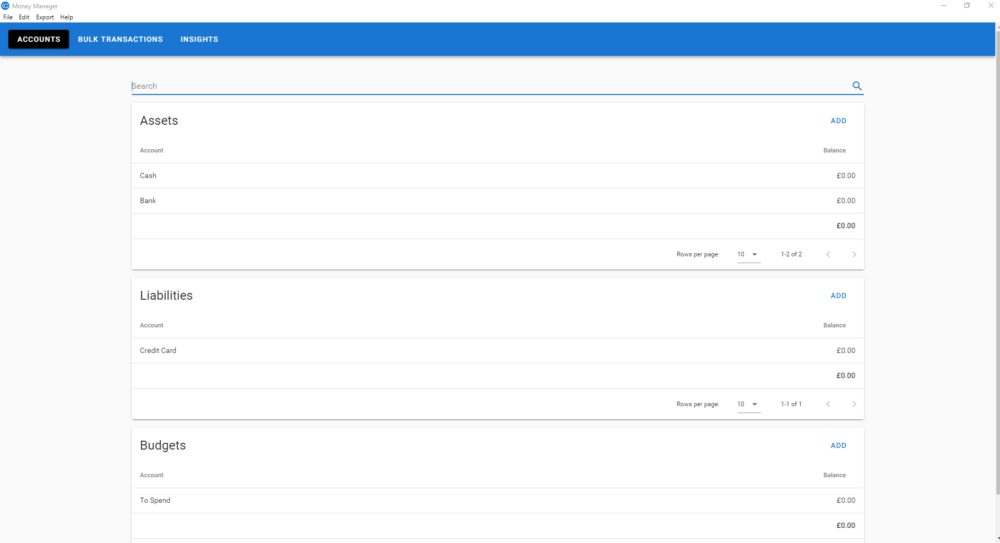

# Money Manager

Money Manager is a desktop application for managing your personal finances and accounts.

It uses [Electron](https://electron.atom.io/) as the application platform and [Vue.js](https://vuejs.org/) as the Front-End UI framework.

## Installation

Download the latest release [here](https://github.com/dhulme/money-manager/releases) and run the setup program. Currently on a Windows build is available.

## Features

🏦🏧💲💱💵💸💶💷💶👛🤑
💳 Keep track of transactions to and from your bank accounts and credit cards
💰 Assign money from your accounts to different budgets
💹 Get insights and analyse your account and budget balances over time
📅 Create bulk transactions that happen regularly, like paying bills or being paid your salary  
📤 Export your accounts and transactions as CSV
🖊️ Highlight important transactions
💾 All your data is stored locally and never sent over the internet
🕒 Monthly backups made of your data

## Screenshots

### Accounts



### Adding a Transaction


## Development Setup

Uses [Electron Vue](https://github.com/SimulatedGREG/electron-vue) to integrate Vue with Electron and handle build process.

```bash
# install dependencies
npm install

# dev server with hot reload at localhost:8080
npm run dev

# compile source to webpack bundle
npm run build

# build packaged distribution with electron builder
npm run dist

# build unpackaged distribution with electron builder
npm run dist:dir
```

## Licence

MIT

## Data Structure

### Account

```javascript
{
  balance: String,
  category: String,
  id: String, // human readable
  name: String,
  transactionIds: [String...],
  type: String // one of 'asset', 'budget' or 'none',
	deleted: Boolean,
	importTransactionsFormatId: String
}
```

### Transaction

```javascript
{
  date: String,
  description: String,
  expense: String, // account ID
  from: String, // account ID
  to: String, // account ID
  note: String,
  value: String,
  highlighted: Boolean
}
```

### Summary

```javascript
{
  balance: String;
}
```

### Bulk Transaction

```javascript
{
  description: String,
  id: String, // human readable
  name: String,
	transactionIds: [String...],
	lastModified: Date
}
```

### Bulk Transaction Transaction

```javascript
{
  from: String, // account ID
  to: String, // account ID
  note: String,
  value: String
}
```

## Settings

Money Manager settings are stored in your Windows user profile folder. Settings structure shown below.

```javascript
{
	projectPath: String,
	lastBackupDates: Object // one key per project
}
```
